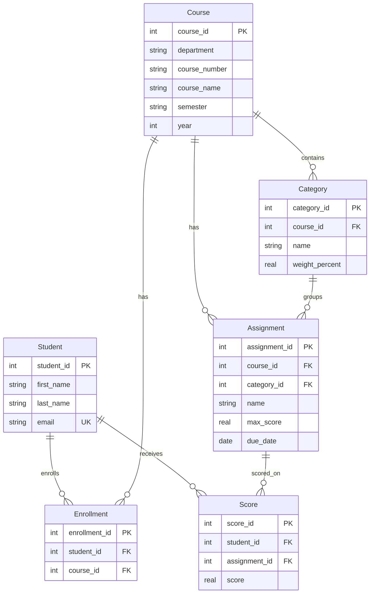

# ER Diagram for Grade Book System

## Textual Explanation

### Entities and Attributes

- **Student** (student_id PK)
  - first_name (NOT NULL)
  - last_name (NOT NULL)
  - email (NOT NULL, UNIQUE)

- **Course** (course_id PK)
  - department (NOT NULL)
  - course_number (NOT NULL)
  - course_name (NOT NULL)
  - semester (NOT NULL)
  - year (NOT NULL)

- **Enrollment** (enrollment_id PK)
  - student_id FK -> Student(student_id)
  - course_id FK -> Course(course_id)
  - UNIQUE(student_id, course_id)  // Prevents duplicate enrollments

- **Category** (category_id PK)
  - course_id FK -> Course(course_id)
  - name (NOT NULL)
  - weight_percent (NOT NULL, CHECK(weight_percent >= 0 AND weight_percent <= 100))

- **Assignment** (assignment_id PK)
  - course_id FK -> Course(course_id)
  - category_id FK -> Category(category_id)
  - name (NOT NULL)
  - max_score (NOT NULL, DEFAULT 100)
  - due_date (DATE)

- **Score** (score_id PK)
  - student_id FK -> Student(student_id)
  - assignment_id FK -> Assignment(assignment_id)
  - score (NOT NULL, CHECK(score >= 0))
  - UNIQUE(student_id, assignment_id)  // One score per student per assignment

### Relationships

- Student **enrolls in** Course (M:N, resolved via Enrollment)
- Course **has** Category (1:N)
- Course **has** Assignment (1:N)
- Category **contains** Assignment (1:N)
- Student **receives** Score for Assignment (M:N, resolved via Score)

### Constraints

- Foreign key constraints ensure referential integrity
- Category weights must sum to 100% per course (enforced via application logic or triggers)
- Scores cannot exceed assignment max_score (enforced via CHECK or application logic)

## ASCII Diagram

```
+----------------+       +----------------+
|    Student     |       |     Course     |
+----------------+       +----------------+
| student_id (PK)|       | course_id (PK) |
| first_name     |       | department     |
| last_name      |       | course_number  |
| email          |       | course_name    |
+----------------+       | semester       |
          |              | year           |
          |              +----------------+
          |                       |
          |                       |
          |                       |
+----------------+       +----------------+
|  Enrollment    |       |   Category     |
+----------------+       +----------------+
| enrollment_id  |       | category_id    |
| student_id (FK)|       | course_id (FK) |
| course_id (FK) |       | name           |
+----------------+       | weight_percent |
          |              +----------------+
          |                       |
          |                       |
          |                       |
+----------------+       +----------------+
|   Assignment   |       |     Score      |
+----------------+       +----------------+
| assignment_id  |       | score_id (PK)  |
| course_id (FK) |       | student_id (FK)|
| category_id (FK)|       | assignment_id  |
| name           |       | score          |
| max_score      |       +----------------+
| due_date       |
+----------------+
```

## Mermaid Diagram


